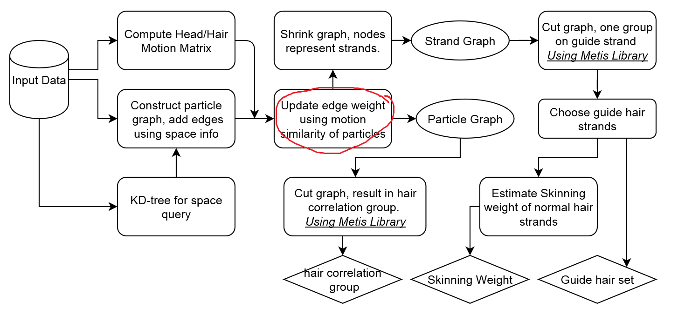

# Report 160310
## Summary
In the early of this week, I generated the high-quality hair simulation result using maya nHair.
The rendering result is shown as follows (5k strands, 100k particles):

Later I started to process these data. Now I am implementing Section 5.2, whose output is a graph describing movement similarity between strands.

As I implement it using python, I benefit much from various library online. However, the drawback is the performance of python, especially for the operations on graphs. Even we only have 5k strands now, It takes minutes to process single frame.

## Implementation Plan

Zhou's algorithm consists of two parts---training and simulation. Since performance is not important for training, I choose to use python for flexibility and abundant libraries. For simulation, I can build upon my previous code of hair simulation.

### Training Part

**Input**  
* Head motion data
* hair strand motion data

**Output**  
* A set of guide hair strands
* hair correlation groups
* skinning weights for normal hair strands

What I am doing now is marked in red in the following flowchart.

### Simulation Part

*This part has not been carefully researched so I only give an overview.*

**Hair/Hair Interaction**  
This part is a common step for hair simulation. But Zhou found that it is a bottleneck for real-time simulation. He gave a strategy to more efficiently update the links between hair edges by using kNN search.

**Skinning Normal Strands**  
It is easy, using the output of training stage, with a linear interpretation algorithm.

**Hair Correlation**  
A optimal method to make normal strands behave as they have volumes. The equation 10 in the paper is easy to evaluate, but minimize the equation in real-time is more complex to implement.
