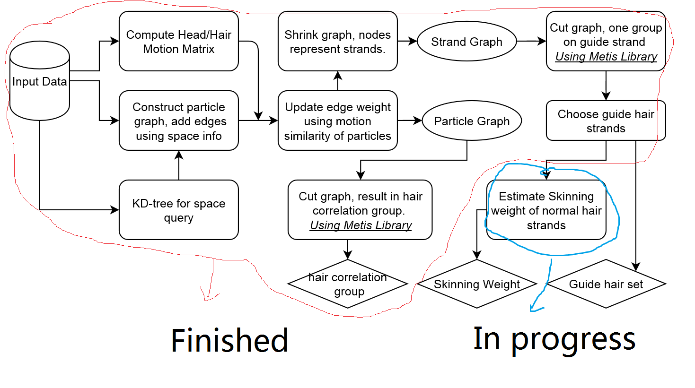
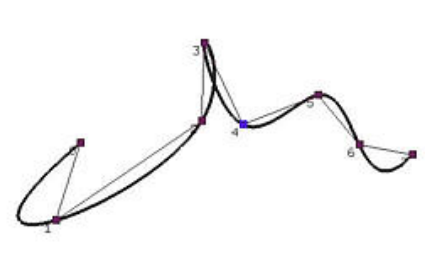
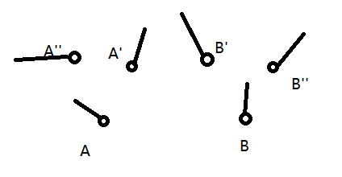
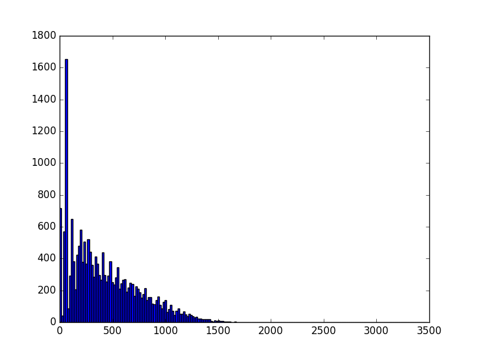
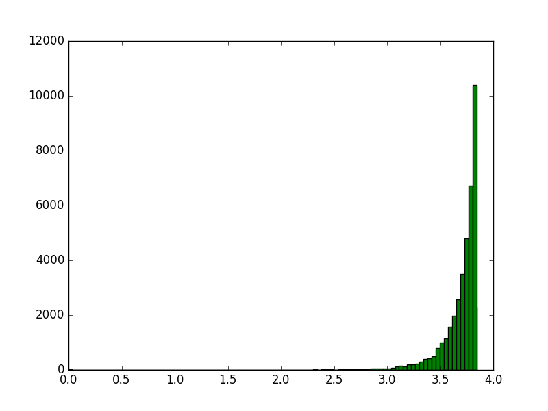

# Report 160310
## Summary

I've nearly finished the training stage of "Reduced Hair Model". Only **Section 5.3** estimating weights has not been implemented so far. The following diagram indicates the progress. Fortunately, there is no big problem for now. The following is only some questions that may slightly affect the implementation.

### B-spline?
In the early a few lines of Section 4, Zhou said his strands are B-spline curves. However, B-spline curve could be spline interpolation, and spline fitting.  

For the first choice, the curve will exactly go through each control point, and the direction of the hair strand is easy to determine. The problem is that when the strand particles become not so smoothly arranged, there may be some part of the curve goes out of the convex hull of control points (like the figure below), leading to visually violate the collision constrain.

For the second choice, the curve is guaranteed inside the convex hull. However, the direction of each particle is meaningless as the they are not on the curve.

The current implementation uses the first choice interpolation.

### Symmetry of similarity of particle motion

Equation 5 in the paper has two terms inside the summary. The problem is that I found these two terms is theoretically the same during computation. I will explain the detail if you are interested in this problem.

## Some analysis graph

* The statistics of the difference of Ids of the two end points of every edges in the strand motion similarity graph. Apparently periodical because of the grid like arrangement of hair strands.

* The statistics of the edge weight. It is strange that most of the edges have the near maximum weight, meaning the end points of the edge have every similar motions.

